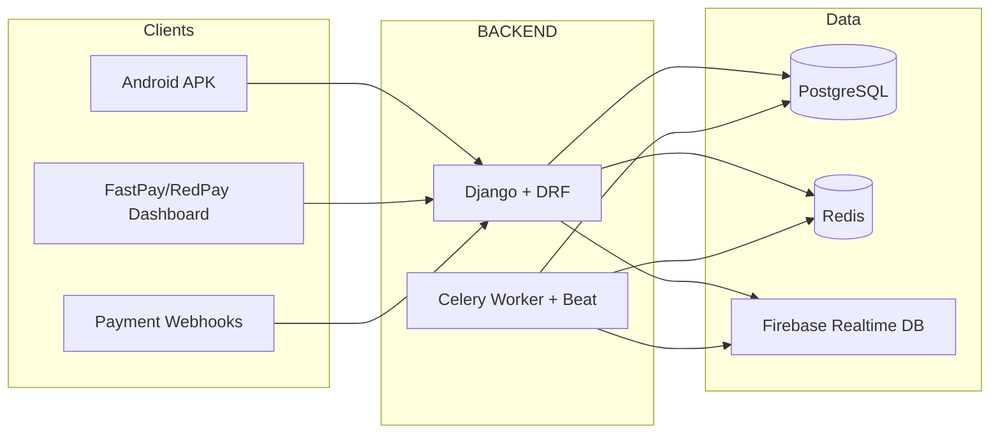

# BACKEND Exploration Summary

This document summarizes the FastPay BACKEND structure, stack, API surface, and deployment. Paths are relative to the repository root (e.g. BACKEND/...).

## What it is

The **BACKEND** is a Django 5 / Django REST Framework API for the FastPay system. It serves the Android APK, the FastPay/RedPay dashboards, and external webhooks. It runs in Docker (PostgreSQL, Redis, Gunicorn, Celery worker/beat, nginx) and supports staging and production via [deploy.sh](deploy.sh) and env files (`.env.staging`, `.env.production`).

---

## Layout

- **Root URLs** ([fastpay_be/urls.py](fastpay_be/urls.py)): `/` (root), `/health/`, `/admin/`, `/api/` (all API).
- **API base** ([api/urls.py](api/urls.py)): REST router + many named paths for dashboard, Gmail, Drive, webhooks, Telegram, tasks, etc.

---

## Tech stack

| Layer          | Choice                                                |
| -------------- | ----------------------------------------------------- |
| Framework      | Django 5.0.1, Django REST Framework 3.14              |
| DB             | SQLite (dev) or PostgreSQL (prod; `DB_ENGINE`)        |
| Cache / broker | Redis (Celery broker; `REDIS_URL`)                    |
| Static/media   | WhiteNoise (static), local `media/` and `storage/`    |
| Async jobs     | Celery 5.3, django-celery-beat, django-celery-results |
| External       | firebase-admin, requests; Gmail/Drive via OAuth       |

Key settings: [fastpay_be/settings.py](fastpay_be/settings.py) (security, CORS, CSRF, email, Celery, DRF). CORS is configurable via `CORS_ALLOW_ALL_ORIGINS` or `CORS_ALLOWED_ORIGINS`.

---

## API app structure ([api/](api/))

- **models.py** — 20+ models: `Item`, `Device`, `Message`, `Notification`, `Contact`, `BankCardTemplate`, `BankCard`, `Bank`, `GmailAccount`, `DashUser`, `ActivityLog`, `CaptureItem`, `FirebaseSyncLog`, `CommandLog`, `AutoReplyLog`, `ActivationFailureLog`, `ApiRequestLog`, `TelegramBot`, `WebhookEvent`, `ScheduledTask`, etc.
- **views/** — Domain split: [core](api/views/core.py), [health](api/views/health.py), [mobile](api/views/mobile.py) (devices, messages, notifications, contacts, filesystem), [banking](api/views/banking.py), [dashboard](api/views/dashboard.py), [gmail](api/views/gmail.py), [drive](api/views/drive.py), [logs](api/views/logs.py), [apk](api/views/apk.py), [telegram](api/views/telegram.py), [tasks](api/views/tasks.py). [views/__init__.py](api/views/__init__.py) re-exports for [api/urls.py](api/urls.py).
- **urls.py** — DefaultRouter for ViewSets (items, devices, messages, notifications, contacts, fs, bank-cards, banks, gmail-accounts, command-logs, telegram-bots, scheduled-tasks, etc.) plus many function-based paths (dashboard login/profile/theme/verification, Gmail OAuth and CRUD, Drive CRUD, webhooks, Telegram helpers, task status, BlackSMS, sync, APK login/register).
- **Services / utils**: [gmail_service.py](api/gmail_service.py), [drive_service.py](api/drive_service.py), [blacksms.py](api/blacksms.py), [api/utils/firebase.py](api/utils/firebase.py) (Firebase init, device/messages/notifications/contacts sync), [api/utils/telegram.py](api/utils/telegram.py).
- **Other**: [webhooks.py](api/webhooks.py) (receive/failed/success/refund/dispute), [tasks.py](api/tasks.py) (Celery), [middleware.py](api/middleware.py) (API request logging), [sync_commands/](api/sync_commands/) (sync contract), [management/commands/](api/management/commands/) (e.g. assign devices, sync Firebase, create super admin).

---

## Main API surface (from urls)

- **Core**: `GET /api/`, `GET /api/health/`, sync contract/status.
- **Devices / mobile**: CRUD for devices, messages, notifications, contacts; filesystem list/upload/download/delete.
- **Banking**: Bank card templates, bank cards, banks.
- **Dashboard**: Login, profile, reset password, update access, configure access, update profile, theme mode, activity logs, send/verify email.
- **Gmail**: OAuth init/callback, status, messages (list/detail), send, bulk-send, modify/delete labels, disconnect, statistics.
- **Drive**: List/detail/download/upload/delete/share/copy files, create folder, storage info, search.
- **Webhooks**: `/api/webhooks/receive/`, `failed/`, `success/`, `refund/`, `dispute/` (optional `X-Webhook-Secret`).
- **Telegram**: Validate token, discover/lookup chats; CRUD for telegram-bots.
- **Tasks**: Scheduled task CRUD, available-tasks, task-status.
- **APK**: validate-login, registerbanknumber, isvalidcodelogin; ip/download/file.
- **BlackSMS**: blacksms/sms/, blacksms/whatsapp/.

---

## Data and integrations

- **PostgreSQL**: Primary store for all Django models; used by Celery results (django-celery-results) and beat schedule (django_celery_beat).
- **Redis**: Celery broker; task queues: `celery`, `telegram`, `sync`, `maintenance`.
- **Firebase**: Optional. Used for device/messages/notifications/contacts sync ([api/utils/firebase.py](api/utils/firebase.py)); env: `FIREBASE_DATABASE_URL`, `FIREBASE_CREDENTIALS_PATH`. Sync commands and management commands (e.g. assign_devices_to_user, hard_sync_firebase) read from Firebase and write to Django.

---

## Deployment

- **Docker Compose** ([docker-compose.yml](docker-compose.yml)): services `db` (Postgres 15), `redis`, `web` (Gunicorn), `celery_worker`, `celery_beat`, `nginx`. Staging uses [docker-compose.staging.yml](docker-compose.staging.yml).
- **Deploy script** [deploy.sh](deploy.sh): `./deploy.sh production` or `./deploy.sh staging`; options: `--no-input`, `--skip-tests`, `--skip-pull`, `--no-rebuild`, `--skip-nginx-reload`, `--skip-notify`, `--test-pattern PATTERN`. Loads `.env.production` or `.env.staging`.
- **Nginx** ([nginx/](nginx/)): Configs in `conf.d/` (api, staging, admin, etc.); [STAGING_NGINX.md](nginx/STAGING_NGINX.md) and apply script for host nginx.
- **Docs**: [README.md](README.md), [BACKEND_DOCUMENTATION.md](BACKEND_DOCUMENTATION.md); repo [docs/VPS_DEPLOY_STRUCTURE.md](../docs/VPS_DEPLOY_STRUCTURE.md) and [docs/GMAIL_DRIVE_DEPLOY.md](docs/GMAIL_DRIVE_DEPLOY.md) for full deploy and Gmail/Drive OAuth.

---

## Testing and config

- **Tests**: Pytest + pytest-django; [api/tests/](api/tests/) (e.g. test_api, test_dashuser_roles, test_scheduled_tasks); [run_tests.sh](run_tests.sh), [.github/workflows/test.yml](.github/workflows/test.yml).
- **Env**: [.env.example](.env.example); production/staging use `.env.production` / `.env.staging` (see repo root `.env.example` for cross-app vars).

---

## Quick file reference

| Purpose        | File(s)                                                                                       |
| -------------- | --------------------------------------------------------------------------------------------- |
| Django project | [fastpay_be/settings.py](fastpay_be/settings.py), [fastpay_be/urls.py](fastpay_be/urls.py), [fastpay_be/celery.py](fastpay_be/celery.py) |
| API routing    | [api/urls.py](api/urls.py)                                                                    |
| Models         | [api/models.py](api/models.py)                                                                |
| Views          | [api/views/](api/views/) (and [api/views_legacy.py](api/views_legacy.py))                     |
| Firebase sync  | [api/utils/firebase.py](api/utils/firebase.py)                                                |
| Gmail/Drive    | [api/gmail_service.py](api/gmail_service.py), [api/drive_service.py](api/drive_service.py)    |
| Webhooks       | [api/webhooks.py](api/webhooks.py)                                                             |
| Celery tasks   | [api/tasks.py](api/tasks.py)                                                                  |
| Deploy         | [deploy.sh](deploy.sh), [docker-compose.yml](docker-compose.yml), [Dockerfile](Dockerfile)     |
| Dependencies   | [requirements.txt](requirements.txt)                                                          |
